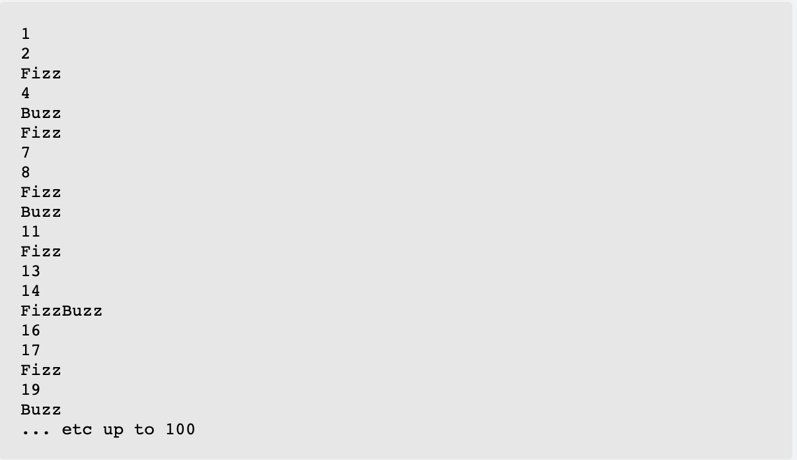

# FizzBuzz

Use TDD to write a method that returns 'Fizz' for multiples of three and 'Buzz' for the multiples of five.
For numbers which are multiples of both three and five return 'FizzBuzz'.
For numbers that are neither, return the input number.

Sample output:

# Filter Strings (Java 8 Lambdas and Streams)
Given a list of strings, write a method that returns a list of all strings that start with the letter 'a' (lower case) and have exactly 3 letters. 
TIP: Use Java 8 Lambdas and Streams API's.

# Comma Separated (Java 8 Lambdas and Streams)
Write a method that returns a comma-separated string based on a given list of integers. 
Each element should be preceded by the letter 'e' if the number is even, and preceded by the letter 'o' if the number is odd. 
For example, if the input list is (3,44), the output should be 'o3,e44'.
